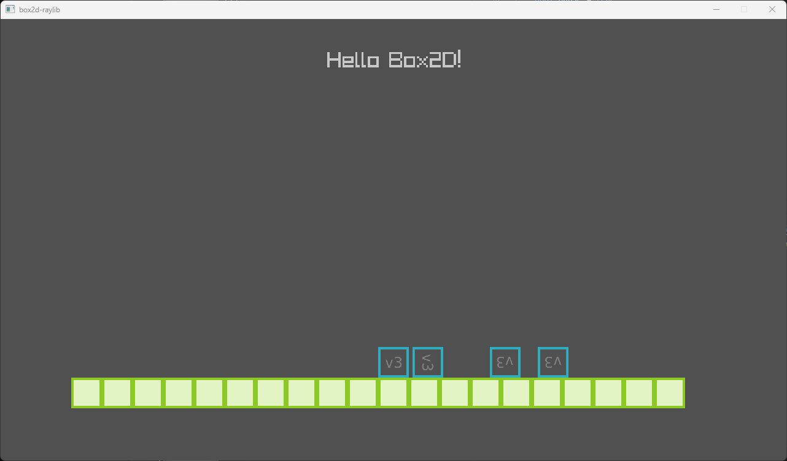

# box2d-raylib
This project shows how to integrate Box2D with Raylib. Raylib provides the windowing and drawing while Box2D provides rigid body physics.
- https://www.raylib.com/
- https://box2d.org/

I use CMake and FetchContent to bring together box2d and raylib with no submodules, packages, or file copying. No library configuration is needed.

If you are not familiar with CMake, I recommend to spend some time getting familiar with it because it is very common in open source programming. Here are some links to get you started:
- https://cmake.org/
- https://cmake.org/cmake/help/latest/guide/user-interaction/index.html
- https://code.visualstudio.com/docs/cpp/cmake-linux

I recommend to get started with cmake-gui which basically a UI on top of the command line CMake. I've had a good experience using VS Code and CMake. I've been able to build, test, and debug Box2D on Windows, macOS, and Linux using VS Code. I even used it to build Box2D on Raspberry Pi.

The demo shows how to setup a simulation coordinate system and transform the results to the screen. I also left some notes showing how I verified the transformation.

Feel free to use this project as a starting point for making a game using raylib and Box2D.

